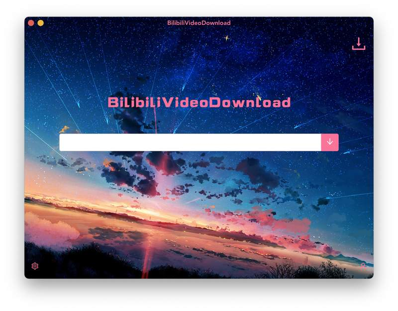
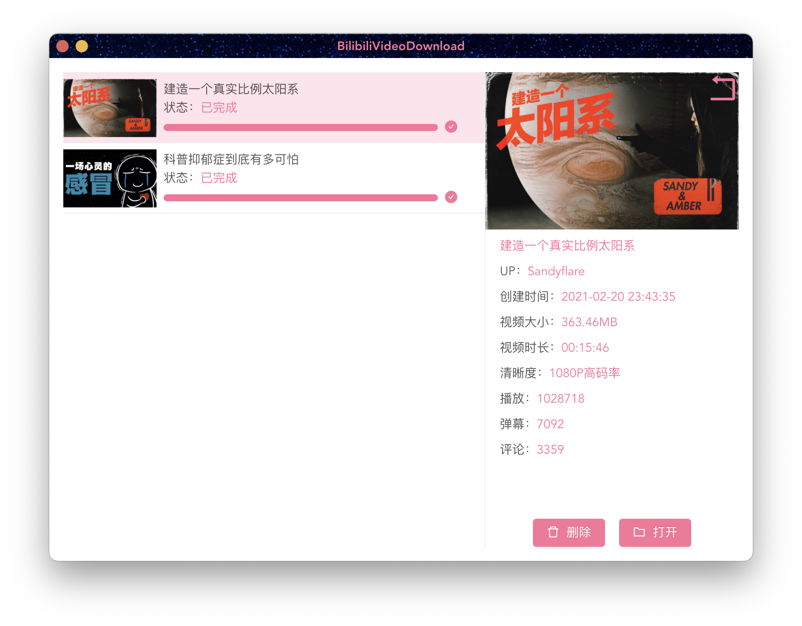
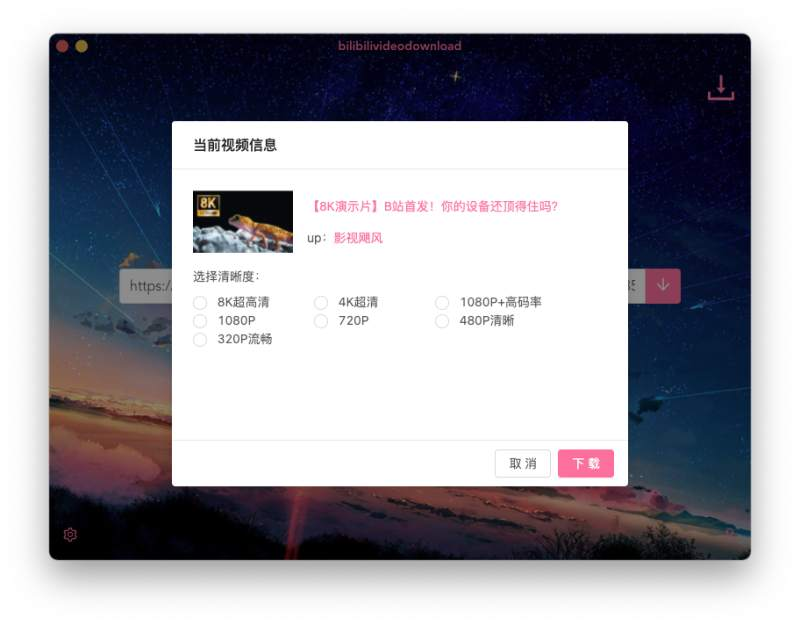
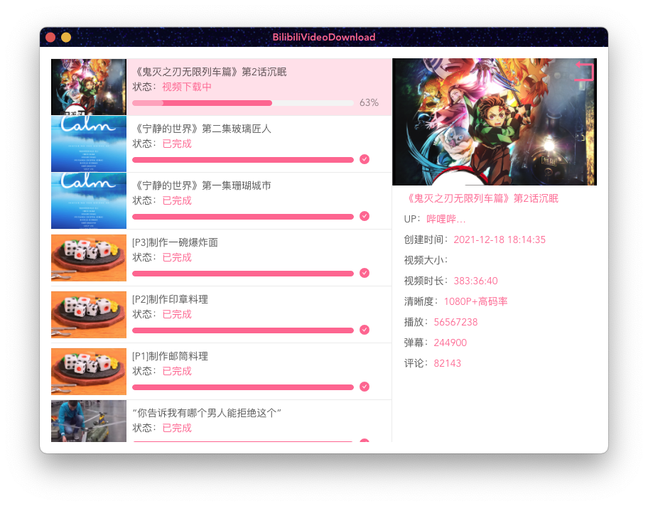

<div align="center">
  
  <h1>BilibiliVideoDownload</h1>
  <blockquote>跨平台下载bilibili视频桌面端软件，支持windows、macOS、Linux</blockquote>
</div>

<div align="center">
  <a href="https://github.com/blogwy/BilibiliVideoDownload/issues"></a>
  <a></a>
  <a></a>
  <a></a>
</div>

## 注意

* 软件不支持付费视频和地区限制视频，可能会报错

* 登录信息有过期时间，好像是半年

* 由于下载的音视频是分离的，项目使用ffmpeg合成导致安装包有点大(ffmpeg大约70+MB)

## 安装

到[releases](https://github.com/blogwy/BilibiliVideoDownload/releases)页面,下载对应平台安装包即可.下载视频时候会提示登录，登录后只会获取你的SESSDATA来用做下载，账号是普通账号最大支持下载1080P视频，大会员可以下载8K视频，不登录最大支持下载480P视频

## 演示








## 功能

* [x] 下载普通视频
* [x] 下载番剧视频
* [x] 下载多P视频
* [x] 下载电影(额外付费除外)
* [x] 下载封面
* [x] 下载字幕
* [x] 下载弹幕
* [x] 下载进度
* [x] 基本视频信息
* [x] 删除下载记录
* [ ] 暂停/恢复下载

## 开发

**提前自备梯子，因为electron electron-builder等依赖项需要从GitHub下载**

```bash
git clone https://github.com/blogwy/BilibiliVideoDownload.git

cd BilibiliVideoDownload

yarn

yarn electron:serve

yarn electron:build
```
## 版本

v3.3.3 `2022-07-02`

1. 修复关闭软件事件不正常错误[issues/88](https://github.com/blogwy/BilibiliVideoDownload/issues/88)
2. 下载列表右键添加播放视频功能[issues/86](https://github.com/blogwy/BilibiliVideoDownload/issues/86)

v3.3.2 `2022-06-04`

1. 修复下载视频的音频码率错误，现在音频码率修改为当前最高音频码率。[issues/76](https://github.com/blogwy/BilibiliVideoDownload/issues/76)
2. 修复更新弹窗点击按钮没反应问题[issues/83](https://github.com/blogwy/BilibiliVideoDownload/issues/83)
3. 添加是否下载封面设置项[issues/81](https://github.com/blogwy/BilibiliVideoDownload/issues/81)
4. 下载地址输入框加入复制/粘贴/全选右键菜单[issues/82](https://github.com/blogwy/BilibiliVideoDownload/issues/82)

v3.3.1 `2022-05-28`

1. 修复弹幕样式异常问题

v3.3.0 `2022-05-12`

1. 升级vue3+typescript electron16
2. 优化代码，使用contextBridge代替Node integration
3. 添加手动输入SESSDATA功能
4. 添加右键重新下载
5. 修改下载文件夹/名格式为[px]视频名称-第一up主名称-bv号-uuid
6. 下载页面添加滚动条
7. 下载弹幕

v3.2.0 `2022-02-26`

1. 支持macOS arm
2. 支持av号解析

v3.1.8 `2021-12-18`

1. EP，SS视频(番剧、纪录片、电影),支持分P(批量)下载

v3.1.7 `2021-12-11`

1. 任务列表添加右键菜单
2. 任务列表按住shift按键可以多选
3. 支持8K视频
4. 支持杜比视界

v3.1.6 `2021-11-06`

1. 修复无法下载问题
2. HDR视频支持

v3.1.5 `2021-10-08`

1. 修复无法删除的bug [issues/41](https://github.com/blogwy/BilibiliVideoDownload/issues/41)
2. 新增回车键确认在主页

v3.1.4 `2021-09-24`

1. 修复在升级版本后，可能会导致设置页面无法关闭问题 [issues/39](https://github.com/blogwy/BilibiliVideoDownload/issues/39)
2. 设置页面新增是否下载到单独文件夹功能

v3.1.3 `2021-09-11`

1. 修复在设置侧边栏登录bug

v3.1.2 `2021-09-02`

1. 修复up主多情况，排版出错的问题 [issues/36](https://github.com/blogwy/BilibiliVideoDownload/issues/36)

v3.1.1 `2021-08-11`

1. 多P视频新增全选功能
2. 新增同时下载最大任务数设置(1~5)

v3.1.0 `2021-06-29`

1. 新增扫码登录获取cookie，不需要手动设置
2. 新增下载字幕功能

v3.0.6 `2021-05-22`

添加多P视频批量下载，同时下载视频数建议不要超过5个，太多我没有测试过可能会卡死。

v3.0.5 `2021-05-15`

添加检查更新

v3.0.4 `2021-04-29`

修复无法下载的bug

v3.0.1 `2021-03-03`

增加错误提示

v3.0.0 `2021-02-21`

全新GUI版本上线

v2.1.0 `2019-09-12`

添加了弹幕下载，以及弹幕反查用户

v2.0.2 `2019-06-19`

添加了大会员清晰度的支持(前提是必须要有一个大会员的SESSDATA)

v2.0.1 `2019-03-29`

添加了分P检测，分P下载功能

v2.0.0 `2019-03-24`

Node.js重构，以前的在vuejs分支

## 感谢

* 特别感谢JetBrains为开源项目提供的免费许可证，申请地址：[https://www.jetbrains.com/zh-cn/community/opensource/#support](https://www.jetbrains.com/zh-cn/community/opensource/#support)
* 感谢[bilibili-API-collect](https://github.com/SocialSisterYi/bilibili-API-collect)B站接口支持
* 感谢[Bilibili-Evolved](https://github.com/the1812/Bilibili-Evolved)弹幕支持
* [FFmpeg](https://ffmpeg.org/)
* [Electron](https://www.electronjs.org/)
* [Vue.js](https://vuejs.org/)
* [Ant Design Vue](https://antdv.com/docs/vue/introduce-cn/)
* [got](https://github.com/sindresorhus/got)

